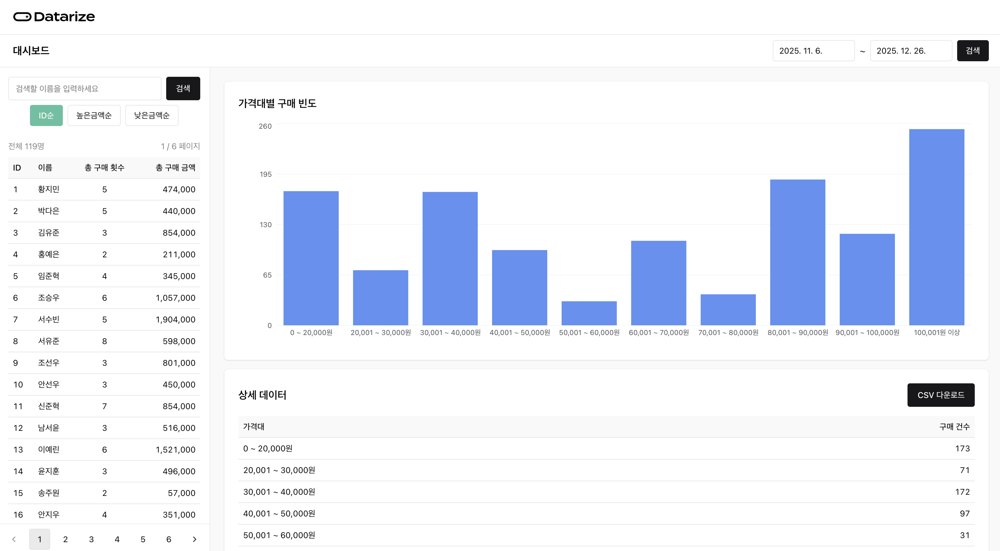
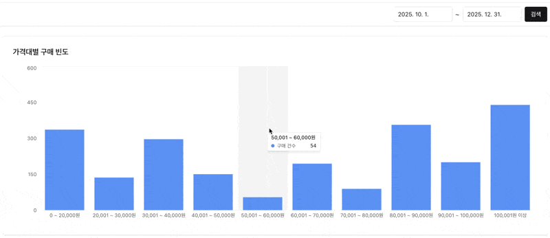
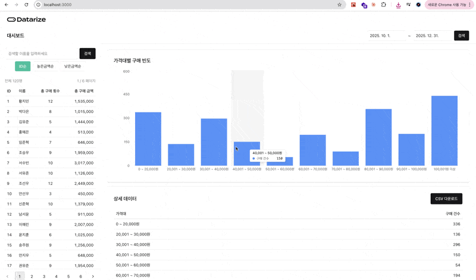
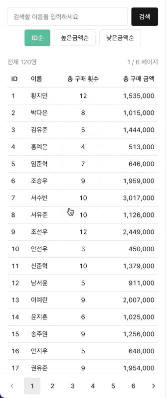
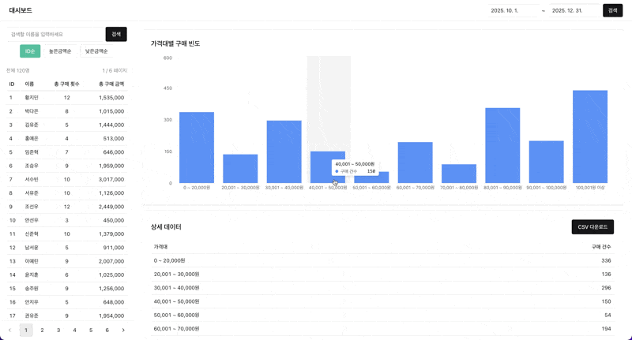

# Datarize Frontend 과제 전형 | 오신정

## 개요

> 🛍️ **쇼핑몰 구매 데이터 대시보드 애플리케이션**   
> 이 애플리케이션은 `2025년 10월~12월 (3개월)` 동안 발생한 구매 데이터를 기반으로 다음의 정보를 제공합니다.
> - 가격대별 구매 빈도 테이블 & CSV 추출 기능
> - 고객 목록 및 검색 기능
> - 고객 상세 구매 내역 조회



<br/>

## 프로젝트 설정 및 실행 방법

### 설치 방법

#### 프로젝트 의존성 설치 및 실행
```bash
cd apps
yarn install
yarn start-server  # 백엔드 서버 실행 (터미널 1)
yarn start-client  # 프론트엔드 개발 서버 실행 (터미널 2)
```
- 백엔드 서버: `http://localhost:4000`
- 프론트엔드: `http://localhost:3000`

<br/>

## 기능 소개

### 가격대별 구매 빈도 테이블



### CSV 추출 기능



### 고객 목록 및 검색 기능



### 고객 상세 구매 내역



<br/>

## 참고 문서

- [체크리스트](https://github.com/ShinjungOh/datarize-fe-assignments/blob/main/docs/checklist.md) - 과제 요구사항을 분석하고 개발 진행 단계별로 나눈 체크리스트
- [아키텍처](https://github.com/ShinjungOh/datarize-fe-assignments/blob/main/docs/architecture.md) - 프로젝트 구조 및 기술 스택
- [과제 요구사항](https://github.com/ShinjungOh/datarize-fe-assignments/blob/main/docs/requirement.md) - Datarize Frontend 과제 전형 README 백업본
