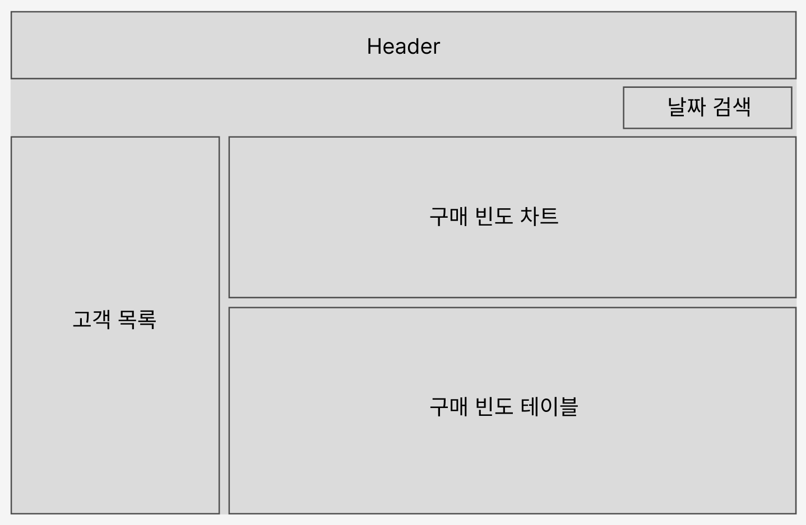

# 체크리스트

## 와이어프레임

## 개발 진행 단계

### 1. 요구사항 분석 및 설계
- [x] 대시보드 와이어프레임 작성
- [x] 기능 명세서 작성
- [x] 프로젝트 구조 설계

### 2. 환경 설정
- [x] 라이브러리 설치
- [x] eslint, prettier, husky 설정

### 3. 서버 API 연동
- [ ] axios api instance
- [ ] 서버 데이터 타입 정의
- [ ] 도메인 별 API 함수 구현
- [ ] API 호출 테스트

### 4. 레이아웃 구현

### 5. 기능 구현
- [ ] 요구사항 기능 구현

### 6. 리팩토링
- [ ] 에러/로딩 처리
- [ ] custom hook 분리
- [ ] 컴포넌트 분리
- [ ] 스타일 토큰 정의

 

## 요구사항 정리

### 1. 가격대별 구매 빈도 테이블 & CSV 추출 기능

- [ ] 가격대별 구매 빈도 테이블 구현
    - [ ] 차트 UI 이용
    - [ ] 2만원 이하~10만원 이상까지 만원 단위로 구분한 차트
- [ ] 날짜 범위 선택 기능
    - [ ] 해당 날짜에 맞는 데이터 필터링
    - [ ] DatePicker 구현
- [ ] CSV 추출 기능 구현

### 2. 고객 목록 및 검색 기능

- [ ] 날짜 범위 선택 기능
    - [ ] 해당 날짜에 맞는 고객 목록 필터링
- [ ] 고객 목록 구현
    - [ ] 고객 ID, 이름, 총 구매 횟수, 총 구매 금액 표시
    - [ ] 구매 금액 순으로 내림차순/오름차순 정렬
    - [ ] 고객 이름 검색 기능

### 3. 고객 상세 구매 내역

- [ ] 고객 Row 클릭 시 상세 구매 내역 표시
    - [ ] 날짜 범위에 맞는 상세 내역 필터링
    - [ ] 구매 날짜, 제품명, 제품 가격, 구매 수량, 상품 썸네일 포함
        - [ ] 상품 썸네일을 클릭하면 원본 이미지를 새 창에서 열도록 구현
